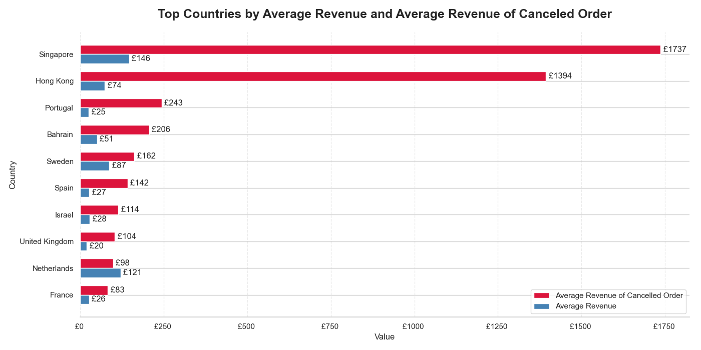
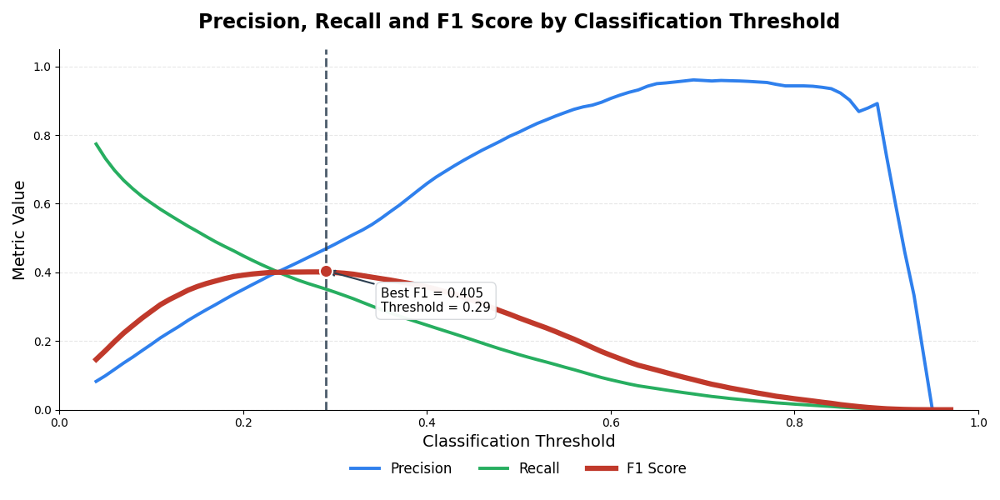

# Marketplace Sales Analytics & Cancellation Prediction

End-to-end data analytics project based on the UCI Online Retail dataset.

The project combines:

- Data cleaning and validation
- PostgreSQL database workflow
- Business analytics with SQL
- Feature engineering
- Machine learning for cancellation prediction
- Model evaluation and threshold optimization

Dataset:
Online Retail Dataset [(UCI Machine Learning Repository)](https://archive.ics.uci.edu/dataset/352/online+retail)

Tools:
Python, Pandas, PostgreSQL, SQL, Scikit-learn, Matplotlib, Seaborn

## Project Goal

Order cancellations create operational costs and forecasting uncertainty for online marketplaces.

The objective of this project was to:

1. Investigate transaction cancellation behavior
2. Build a clean analytical database
3. Perform SQL-based business analysis
4. Engineer predictive features
5. Develop a machine learning model capable of identifying potentially cancelled transactions

## Dataset

Source:
https://archive.ics.uci.edu/dataset/352/online+retail

The dataset contains transactional data from a UK-based online retailer between 2010 and 2011.

### Dataset Overview

- 541,909 transaction rows
- 8 original variables
- Customers from multiple countries

## SQL Workflow

The cleaned dataset was loaded into PostgreSQL.

SQL was used to:

- Aggregate customer statistics
- Calculate product popularity
- Measure cancellation rates
- Analyze revenue by country
- Generate business-level insights
- Create features later used in machine learning models

Example SQL applications:

- Top products by revenue
- Top countries by order volume
- Customer order frequency
- Cancellation rate analysis
- Average revenue per customer


## Business Insights

### Revenue and Cancellation Analysis by Country



Countries such as Singapore and Hong Kong showed unusually high average revenue among cancelled orders, suggesting that high-value orders may exhibit different cancellation behavior than the overall marketplace.


## Feature Engineering

Features were created from customer, product, and transaction information.

Examples:

### Customer Features

- Customer order count
- Average customer revenue

### Product Features

- Product popularity
- Average product quantity
- Average product price

### Relative Features

- Product price ratio
- Product quantity ratio

### Time Features

- Month
- Weekday
- Hour

## Cancellation Prediction

Target:

- Predict whether a transaction will be cancelled

Models tested:

- Logistic Regression
- Random Forest

## Class Imbalance

Only 1.7% of transactions were cancelled.

Class distribution:

- Not Cancelled: 98.3%
- Cancelled: 1.7%

Because of this imbalance, accuracy alone was not an informative metric.

The evaluation focused on:

- Precision
- Recall
- F1 Score
- ROC-AUC

## Threshold Optimization

The default classification threshold (0.50) produced low recall despite a strong ROC-AUC score.

Different thresholds were evaluated to improve the balance between precision and recall.

### Random Forest Results

Default threshold:

- F1 Score ≈ 0.24

Optimized threshold (0.25):

- F1 Score ≈ 0.41

Threshold optimization improved the F1 score by approximately 70%.


## Final Results

Model: Random Forest

| Metric | Score |
|----------|-------|
| Precision | 0.42  |
| Recall | 0.38  |
| F1 Score | 0.40  |
| ROC-AUC | 0.89  |




The model successfully identified cancellation patterns despite severe class imbalance.


## Project Structure
```
marketplace_sql_ml_analytics_project
│
├── data
│   ├── raw
│   │   └── Online Retail.xlsx
│   └── processed
│       └── retail_clean.csv
│
├── notebooks
│   ├── 01_cleaning.ipynb
│   ├── 02_sql_analysis.ipynb
│   └── 03_cancellation_prediction.ipynb
│
├── src
│   ├── db_connection.py
│   └── load_data.py
│
├── requirements.txt
├── README.md
├── LICENSE
└── .env
```

## Future Improvements

- Time-based validation strategy
- Gradient Boosting / XGBoost models
- Automated feature pipelines
- Deployment as an interactive dashboard
- Real-time cancellation risk scoring